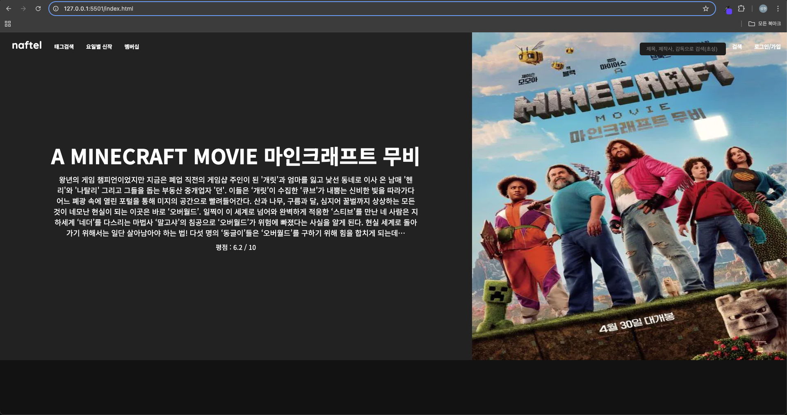
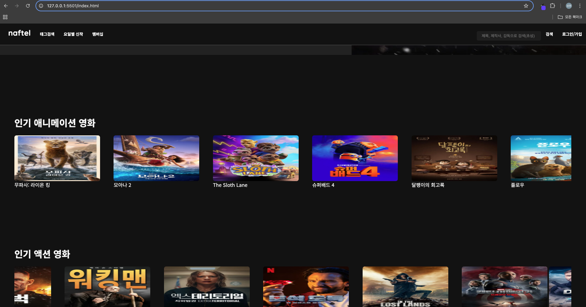
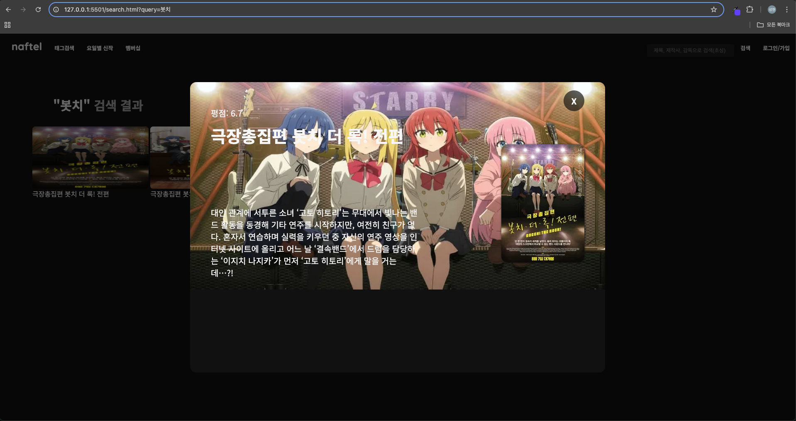

# laftel-clone
TMDB 영화정보 API를 활용하여 영화 정보를 검색하고
카테고리별로 현재 인기있는 영화를 알아볼수있는 웹 페이지

# 구현 해야하는것
1. 라프텔 웹 페이지 디자인을 기반으로 멋진 UI만들기
2. fetch로 TMDB API에 데이터를 요청후 웹 페이지에 출력
3. 받아온 데이터로 영화 포스터, 영화제목, 평점, 요약등의 정보를 포함하는 카드 리스트 UI를 HTML, CSS로 구현
4. 유저가 입력한 검색어와 관련된 영화만 필터링 하는 기능 구현 
5. 각 영화 카드를 클릭했을때, 해당 영화의 ID로 TMDB API에서 상세 정보를 받아와 화면에 표시해주는 모달 구현

# 완성본
- 메인 베너 로테이션

- 장르별 인기영화 로테이션

- 영화 검색기능과 모달

